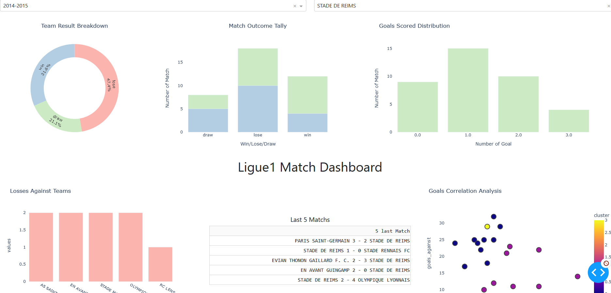

# Ligue1 Team Performance Dashboard

## Project Overview
This project is a comprehensive analysis and visualization tool for Ligue1 football team performances. It scrapes Ligue1 match scores and presents interactive visualizations using a Dash web application.

## File Structure
    ligue1/
        │ ligue1/ # Contains all the code for scraping Ligue1 scores
        │ my_log.log # Log file for the scraping process
        │ scrapy.cfg # Configuration for Scrapy framework
    output/
        │ finalDt.xlsx # Excel file with the final data output
        │ output.json # JSON file with the output from the scraping process
    main_.py # Main Dash application file for running the web server
    requirement.txt # Contains all the necessary packages for the project

## Installation
Clone this repository and navigate into the project directory. Install the required packages using the following command:
```bash
pip install -r requirement.txt
```
## Usage
Run the Dash application server by executing the main script:

```bash
python __main__.py
```
The web application will be accessible in your web browser at the default address (typically http://127.0.0.1:8050/).

## Features

The Dash application includes:
- Dropdown menus for selecting the season and team
- Interactive graphs displaying team performance over selected seasons:
- Pie chart of win/draw/lose statistics.
- Bar chart comparing home and away game outcomes.
- Goal frequency analysis.
- Analysis of the most common opponents in lost matches.
- A table displaying the results of the last five matches.
- Scatter plot clustering teams based on goal statistics.

Data is sourced from output/output.json and transformed to provide the visualizations

## Application Screenshot
Here is a screenshot of the dashboard:


## Authors

[JathurshanG](https://github.com/JathurshanG) - Initial work


